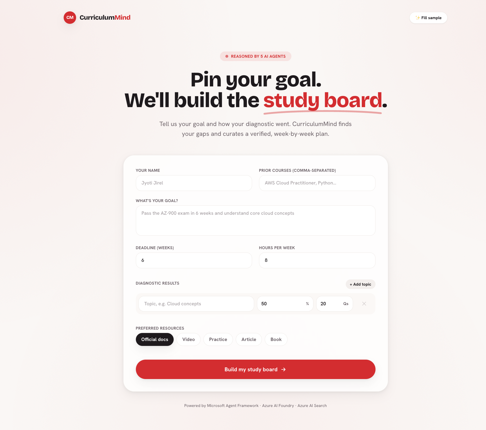

# CurriculumMind 🎓

> 🎓 AI-powered study plan generator using a 5-agent pipeline on Microsoft Agent Framework & Azure AI Foundry. Diagnoses knowledge gaps, plans milestones, curates resources, and verifies the plan — all from a single student profile. Built for Microsoft Agents League Hackathon 2026.


---

## What it does

You fill in your **goal**, **deadline**, and **quiz scores** per topic. CurriculumMind runs a 5-agent pipeline that:

1. Diagnoses exactly where your knowledge gaps are and how severe each one is
2. Plans a week-by-week milestone sequence that closes every gap in order
3. Curates the best learning resources per gap and adjusts pacing to your available hours — simultaneously
4. Verifies the plan is logically sound, corrects it if needed, then returns it

The result is a fully reasoned, verified, personalized study board — rendered in a Pinterest-style Next.js UI.

---

## Demo

> 📹 **[Watch the demo video](#)**



---

## Agent architecture

```
StudentProfile (goal + diagnostic scores)
       │
       ▼
┌─────────────────────┐
│  DiagnosticAnalyzer │  → knowledge gaps with severity + evidence
└─────────────────────┘
       │
       ▼
┌─────────────────────┐
│    GoalPlanner      │  → week-by-week milestones ordered by prerequisites
└─────────────────────┘
       │
       ├──────────────────────────────┐  asyncio.gather() — parallel
       ▼                              ▼
┌──────────────────┐    ┌──────────────────────┐
│ ContentCurator   │    │    PaceReasoner       │
│ (Azure AI Search)│    │ (time-adjusted plan)  │
└──────────────────┘    └──────────────────────┘
       │                              │
       └──────────────────────────────┘
                        │
                        ▼
              ┌─────────────────┐
              │    Verifier     │  → quality gate + one correction pass
              └─────────────────┘
                        │
                        ▼
                  StudyPlan ✅
```

**ContentCurator and PaceReasoner run in parallel** via `asyncio.gather()` — cutting stage 3 latency in half.

If the Verifier flags issues, GoalPlanner and PaceReasoner re-run once with the feedback attached. The best-effort plan is always returned with its verification status.

---

## Microsoft IQ integration

This project uses **Foundry IQ** — the agentic intelligence layer from Azure AI Foundry:

- All 5 agents connect to a hosted `gpt-4.1-mini` deployment via `FoundryChatClient`
- `ContentCurator` uses **Azure AI Search** for grounded, cited resource retrieval
- `DefaultAzureCredential` in dev, `ManagedIdentityCredential` in production — no hardcoded secrets

---

## Project structure

```
curriculummind/
├── backend/
│   ├── agents/                    # One file per agent
│   │   ├── base.py                # Retry, JSON extraction, structured logging
│   │   ├── diagnostic_analyzer.py
│   │   ├── goal_planner.py
│   │   ├── content_curator.py     # Azure AI Search integration
│   │   ├── pace_reasoner.py
│   │   └── verifier.py
│   ├── orchestrator/
│   │   └── pipeline.py            # Async pipeline — parallel stage 3 + reasoning trace
│   ├── api/
│   │   ├── app.py                 # FastAPI factory + typed exception handlers
│   │   ├── routers/               # /health, /api/v1/plans
│   │   ├── schemas/               # HTTP-layer request/response models
│   │   └── middleware/            # Request logging
│   ├── core/
│   │   ├── models.py              # Pydantic domain models (StudentProfile → StudyPlan)
│   │   ├── exceptions.py          # Typed exception hierarchy → HTTP codes
│   │   ├── config.py              # Cached settings singleton
│   │   └── logging.py             # structlog JSON/console
│   ├── services/
│   │   ├── foundry_client.py      # @lru_cache FoundryChatClient factory
│   │   └── search/azure_search.py # Azure AI Search wrapper (graceful fallback)
│   ├── scripts/
│   │   └── seed_search_index.py   # Creates + seeds the Azure Search index
│   ├── tests/
│   │   ├── unit/                  # Agent-level (fully mocked, no Azure needed)
│   │   └── integration/           # Pipeline-level (fully mocked)
│   ├── infrastructure/docker/     # Dockerfile + docker-compose
│   ├── data/sample_profiles/      # Sample inputs
│   └── main.py
└── frontend/
    ├── app/
    │   ├── page.jsx               # setup → loading → results state machine
    │   ├── layout.jsx             # fonts + metadata
    │   ├── icon.svg               # CM favicon
    │   └── opengraph-image.jsx    # dynamic social share card
    ├── components/
    │   ├── SetupForm.jsx          # goal + diagnostic form
    │   ├── LoadingOverlay.jsx     # animated 5-agent progress
    │   ├── Results.jsx            # assembles the study board
    │   ├── ReasoningTrace.jsx     # multi-step agent reasoning panel
    │   ├── MilestoneCard.jsx      # weekly milestones + tick-off checklist
    │   ├── GapCard.jsx · ResourceCard.jsx · CopyPlanButton.jsx · Reveal.jsx …
    └── lib/
        ├── api.js                 # fetch helper → /api/v1/plans/generate
        ├── exportPlan.js          # plan → Markdown export
        └── progress.js            # checklist progress (localStorage)
```

---

## Quickstart

### Prerequisites
- Python 3.11+
- Node.js 18+
- [Azure AI Foundry](https://ai.azure.com) project with a deployed model
- Azure CLI (`az login`) for local auth

### Backend

```bash
cd backend

# Create and activate conda environment
conda create -n curriculummind python=3.11 -y
conda activate curriculummind

# Install dependencies
pip install -e ".[dev]"

# Configure environment
cp .env.example .env
# Fill in FOUNDRY_PROJECT_ENDPOINT (required) and Azure Search credentials

# Authenticate with Azure
az login

# (Optional) Seed Azure AI Search with real learning resources.
# Skip this and ContentCurator falls back to model-generated resources.
python scripts/seed_search_index.py

# Run
python main.py
# → http://localhost:8000
# → http://localhost:8000/docs (Swagger UI)
```

### Frontend

```bash
cd frontend
npm install
npm run dev
# → http://localhost:3000
```

### Test the pipeline

Open `http://localhost:3000`, fill in your goal + diagnostic scores, and hit **"Build my study board"**.

Or hit the API directly:

```bash
curl -X POST http://localhost:8000/api/v1/plans/generate \
  -H "Content-Type: application/json" \
  -d @backend/data/sample_profiles/az900_student.json
```

---

## Running tests

```bash
cd backend
pytest tests/ -v --cov=. --cov-report=term-missing
```

All tests are **fully mocked** — no Azure credentials required.

---

## Key design decisions

| Decision | Reason |
|----------|--------|
| `asyncio.gather` in stage 3 | ContentCurator and PaceReasoner are independent — parallel execution saves ~50% of stage latency |
| Typed exception hierarchy | Each exception maps to a precise HTTP code in `api/app.py` |
| `BaseAgent.parse_json_output` three-pass extraction | LLMs sometimes wrap JSON in fences or prose — raw → fence → brace extraction handles all cases |
| One Verifier correction pass | Avoids infinite loops; best-effort plan always returned |
| `@lru_cache` on Foundry client | Expensive auth handshake happens once at startup, not per request |
| Pydantic v2 domain models at every agent boundary | Type errors surface immediately rather than propagating silently |
| Graceful Verifier degradation | If the corrected plan still has minor issues, it's returned with issues attached — not discarded |

---

## Environment variables

| Variable | Required | Description |
|----------|----------|-------------|
| `FOUNDRY_PROJECT_ENDPOINT` | ✅ | Azure AI Foundry project URL |
| `FOUNDRY_MODEL_DEPLOYMENT_NAME` | default: `gpt-4o` | Model deployment name |
| `AZURE_SEARCH_ENDPOINT` | optional | Azure AI Search endpoint |
| `AZURE_SEARCH_API_KEY` | optional | Azure AI Search API key |
| `AZURE_SEARCH_INDEX_NAME` | default: `learning-resources` | Search index name |
| `APP_ENV` | default: `development` | `development` / `staging` / `production` |
| `APPLICATIONINSIGHTS_CONNECTION_STRING` | optional | Enables distributed tracing |

---

## Tech stack

| Layer | Technology |
|-------|------------|
| Agent framework | Microsoft Agent Framework 1.0 |
| Model hosting | Azure AI Foundry (GPT-4.1 Mini) |
| Resource retrieval | Azure AI Search |
| Backend | FastAPI + Pydantic v2 + Python 3.11 |
| Frontend | Next.js 14 + Tailwind CSS |
| Fonts | Bricolage Grotesque + Hanken Grotesk |
| Logging | structlog |
| Retry | tenacity (exponential backoff) |
| Container | Docker (non-root user) |

---

## Hackathon

**Microsoft Agents League 2026** · Reasoning Agents track · [aka.ms/agentsleague](https://aka.ms/agentsleague)
